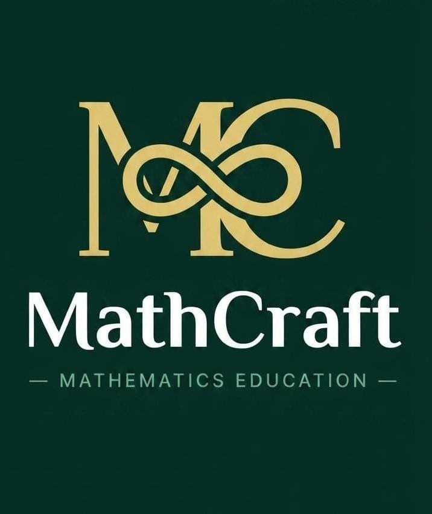

# MathCraft

**Mathematics Education**

---
## 🚀 Key Features
* **Structured Curriculum:** Guided learning paths for various math topics.
* **Interactive Practice:** 500+ problems with real-time feedback.
* **Built-in Tools:** Integrated scientific calculator and formula library.
* **Distraction-Free:** Optimized UI/UX for focused learning.

## 🌐 Live Demo
Experience the platform here: [https://romakhedr.github.io/MathCraft/](https://romakhedr.github.io/MathCraft/)

## 🛠 Tech Stack
* **Frontend:** HTML5, CSS3, JavaScript.
* **Design:** Clean, minimalist 'Quiet Luxury' aesthetics.

## 📝 About
MathCraft aims to empower students worldwide by providing a reliable and efficient learning environment.

---
*Built with passion by Reham Hamdy Elsayed.*
